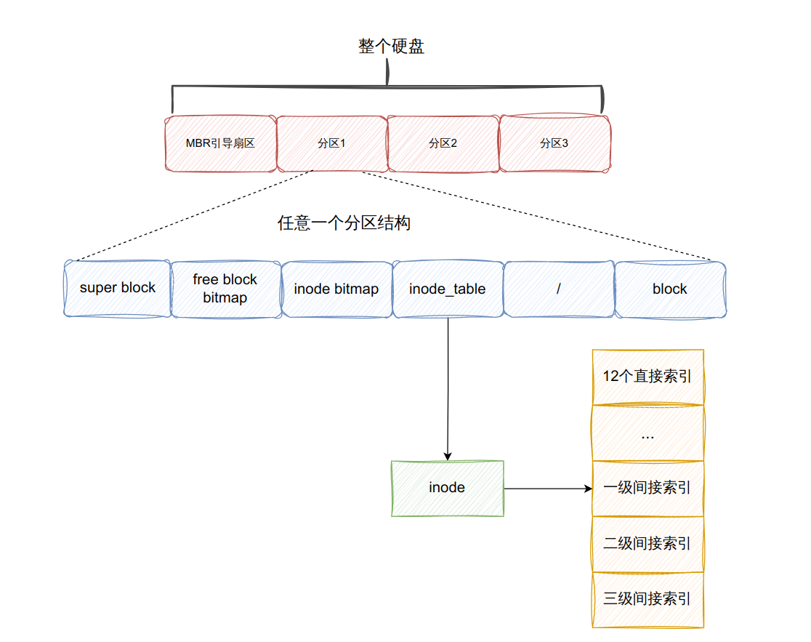

## zhuOS

### 启动
接电一瞬间，CPU 寄存器强制初始化到 BIOS 的入口地址 0xffff0，这个地址是只读 ROM 固化的硬盘中的 BIOS 程序，随后 BIOS 开始对计算机各个部件进行初始化，报告错误。完成这些工作后，BIOS 开始在启动设备表中寻找可启动设备 mbr,一般 mbr 存放在 0 盘 0 道 1 扇区，末尾由 0x55 和 0xaa 标识。找到该设备后，BIOS 将 mbr.bin 加载到硬盘的第一个扇区0x7c00 处。一个扇区只有 512 字节，无法为内核准备好环境，所以 mbr 会将 loader 从硬盘加载到内存。loader 负责完成初始化环境能够以及加载内核的任务。

#### loader职责
- 利用 BIOS 中断e820、e801、88 获取物理内存总量
- 进入保护模式：打开 A20 地址总线、在 gdtr 寄存器中加载 GDT 地址及偏移量、将 cr0 寄存器第 0 位置 1
- 启用分页机制，追备好也目录项和页表，将页表写入控制寄存器，寄存器 cr0 的 PG 位置 1
- 加载内核
    - 将内核文件加载到内存缓冲区
    - 初始化内核，在分页后，将加载进来的 elf 内核文件安置到相应的虚拟内存地址，然后跳过去执行，loader工作结束

#### 全局描述符表 GDT
- 保护模式下内存段不再是简单的用段寄存器加载段基址就能直接用，段中添加了很多其他信息，如段界限、段读写权限、段特权级等，这些信息定义在段描述符中，段描述符定义在段描述符表中，一个段描述符只用来定义一个内存段
- 全局描述符表 GDT 是保护模式下内存段的登记表，存在于内存中，有专门的寄存器 GDTR 指向他。GDT 相当于描述符的数组，数组中的每个元素都是 8 字节的描述符
- 段寄存器中存放的是选择子，选择子的高 13 位，第 3～15 位是描述符的索引值，用此值在 GDT 中索引描述符，相当于 GDT 的下标。选择子的作用主要是确定段描述符
- 描述符表包括全局描述符表和局部描述符表，全局描述符表每个 CPU 只有一个，因为全局描述附表存内存中。Linux 内存模式为平坦模式，即所有段描述符中的段基址为全 0，段界限为全 1，这样只需不同特权级的任务有不同的数据段描述符、代码段描述符(读写权限不同)
  
### 中断
中断是指 CPU 暂停正在执行的程序，转而去执行处理其他事件的程序，当这段程序执行完毕后，CPU 继续执行刚才的程序。中断是提升整个系统利用率最有效的方式
- 中断分为外部中断和内部中断。

#### 外部中断
外部中断又称为硬件中断，中断源必须是某个硬件。外部中断又分为可屏蔽中断和不可屏蔽中断。
- 可屏蔽中断指的是可以通过 eflags 寄存器的 IF 位将这些外部设备中断屏蔽。这类中断 CPU 可以选择不用理会，也可以把中断分为上半部分和下半部分来处理。上半部分是需要立即执行无法耽误的事情，所以上半部是在关中断不被打扰的情况下执行的。当上半部执行完成后就把中断打开了，下半部也属于中断处理程序，所以中断处理程序下半部则是在开中断的情况下执行的，如果有新的中断发生，原来这个旧中断的下半部就会被换下 CPU，先执行新的中断处理程序的上半部，等待线程调度机制为旧中断处理程序择一日期（就是指调度算法认为的某个恰当时机）后，再调度其上 CPU 完成其下半部的执行。
- 不可屏蔽中断是“即将宕机”的中断，CPU 收到此中断后，通过在中断描述符表中查询相应的中断向量号检索对应的中断处理程序去执行

#### 内部中断
内部中断可分为软中断和异常。
- 软中断是由软件主动发起的中断，中断指令有“int 8位立即数”、“int3”（调试断点指令）等，int n型的软中断用于实现系统调用功能，无视IF位
- 异常分为三种，Fault故障（可修复，最轻的异常，比如page fault）、Trap陷阱、Abort终止（最严重的异常类型，操作系统为了自保会将此程序从进程表中去掉）

#### 中断描述符表 IDT
中断描述符表是保护模式下用于存储中断处理程序入口的表，当 CPU 接收一个中断时，需要用中断向量在此表中检索对应的描述符，在该描述符中找到中断处理程序的起始地址，然后执行中断处理程序

### 内存管理

#### 位图
位图是用字节中的 1 位来映射其他单位大小的资源，按位与资源之间是一对一的对应关系，组合起来就形成了映射。

 

`struct bitmap` 中只定义两个成员：位图指针 bits 和位图的字节长度 btmp_bytes_len。位图长度取决于所管理资源的大小，长度不固定，所以用指针来记录位图的地址，真正的位图由上一级模块提供并赋给 bits。
- bitmap_scan_test 函数判断位图 btmp 中的第 bit_idx 位是否为 1，此函数被 bitmap_scan 调用，多次调用可获得连续多个可用位。
- bitmap_scan 函数通过两个参数 位图指针 btmp 和位的个数 cnt 来找到连续的 cnt 个可用位，并返回起始空闲下标。0 表示空闲。
- bitmap_set 函数将位图 btmp 中的第 bit_idx 位设置为 value。

#### 内存管理系统
在分页机制下引入虚拟地址和物理地址，并通过页表将这两类地址关联。真相还原操作系统将内存池分为用户物理内存池和内核物理内存池，各占一半物理内存。
- 用户内存池中的内存都被用户进程耗尽时，不会像内核内存池申请，而是直接返回错误。
- 内核完成某项工作时从内核虚拟地址申请内存，单位 4KB，再从内核物理内存池中分配物理内存，然后在内核自己的页表中建立好这两种地址的映射关系。
- 内存管理首先分配页内存，先整页分配，后实现 malloc 申请任意字节尺寸的内存
    - 先访问页目录表，页目录表中存的是页目录项，页目录项中找到页表，页表中存了虚拟地址对应的起始物理地址，该起始物理地址加上页偏移就是真正的物理地址
  
### 进程调度
进程是资源分配的最小单位，线程是 CPU 调度的最小单位。zhuOS 中实现了一种基于时间片的抢占式的轮询调度算法。
- 时间片指的是利用上文的时钟中断实现，为每个线程分配一段时间片即上 CPU 运行时间，该线程可能会因为时间片用完或者被中断打断下 CPU。
- 抢占式指的是不会等进程主动让出 CPU 而是通过中断打断
- 轮询即先进先出
  - 维护两个等待队列，ready_list 和 all_list,在上一个进程时间片耗尽后，时钟中断处理程序会调用 schedule 调度器检测 ready_list 中的任务上 CPU 执行，若无任务调度会调用 hlt 停机指令进入休眠状态
  
#### 线程同步机制
- 线程同步目的：不管线程如何混杂执行，都不会影响结果的正确性
- 锁采用信号量实现，信号量就是个 0 以上的整数值，为 0 表示无可用信号
- 信号量是计数值，用 P 减少，V 增加。UP 包括两个微操作
    - 将信号量加 1
    - 唤醒在此信号量上等待的线程
  
  DOWN 操作包括三个子操作：
    - 判断信号量是否大于 0
    - 大于 0 则减 1
    - 等于 0 则当前线程将自己阻塞，在此信号量上等待
  
#### 任务切换
- Linux 任务切换未采用 Intel 的做法, 而是用了一套自己的方法, 只是用了 TSS 的一小部分功能
- TSS 任务状态段是处理器在硬件上原生支持多任务的一种实现方式 ，TSS 是每个任务都有的结构，用于一个任务的标识
- TSS 是硬件支持的系统数据结构，它和 GDT 等一样由软件填写其内容，由硬件使用
- 在 CPU 眼里，任务切换实质就是 TR 寄存器指向不同的 TSS

### 系统调用
- 在中断门实现系统调用，效仿 Linux 用 0x80 号中断作为系统调用入口
- 在 IDT 中安装 0x80 号中断对应的描述符，在该描述符中注册系统调用相对应的中断处理例程
- 建立系统调用子功能表 syscall_table,利用 eax 寄存器中的子功能号在该表中索引相应的处理函数
- 用宏实现用户空间系统调用接口 syscall,最大支持 3 个参数的系统调用，故只保存 syscall[0-3]，寄存器传递参数，eax 为子功能号，ebx 保存第一个参数，ecx 保存第二个参数，edx 保存第三个参数

### 文件系统

 

- 每个文件都有自己单独的 inode，inode 是文件实体数据块在文件系统上的元信息
- 所有文件的 inode 集中管理，形成 inode 数组，每个 inode 编号就是在该 inode 数组中的下标
- inode 中的前 12 个直接数据块指针和后 3 个间接块索引表用于指向文件的数据块实体
- 文件系统中并不存在具体称为“目录”的数据结构,同样也没有称为“普通文件”数据结构,统一用同一种 inode 表示。inode 表示的文件是普通文件,还是目录文件，取决于 inode 所指向数据块中的实际内容是什么,即数据块中的内容要么是普通文件本身的数据,要么是目录中的目录项
- 目录项仅存在于 inode 指向的数据块中,有目录项的数据块就是目录,目录项所属的 inode 指向的所有数据块便是目录
- 目录项中记录的是文件名、文件 inode 的编号和文件类型,目录项起到的作用有两个，一是粘合文件名及 inode,使文件名和 inode 关联绑定,二是标识此 inode 所指向的数据块中的数据类型(比如是普通文件,还是目录,当然还有更多的类型)
- inode 是文件的“实质”,但它并不能直接引用,必须通过文件名找到文件名所在的目录项,然后从该目录项中获得 inode 的编号,然后用此编号到 inode 数组中去找相关的 inode,最终找到文件的数据块。
- super block负责保存文件系统元信息的元信息：inode 数组的地址及大小、inode 位图地址及大小、根目录的地址和大小、空闲块位图的地址和大小。super block被固定存储在各分区的第二个扇区
- 在操作系统引导块 mbr 后面的依次是：超级块、空闲块的位图、inode 位图、inode 数组、根目录、空闲块区域
