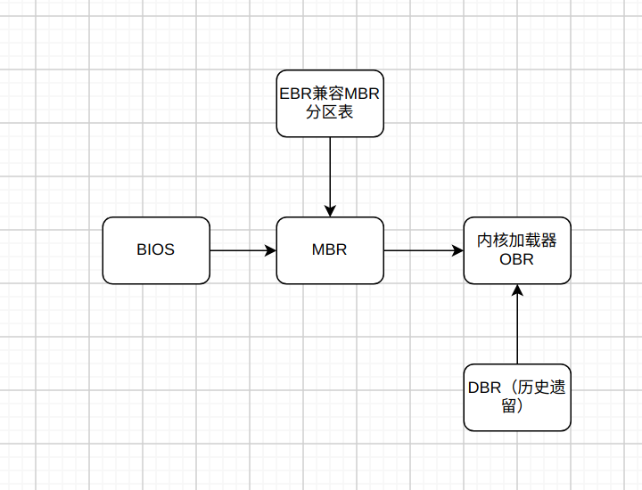

# 真相还原 Q & A

- [真相还原 Q \& A](#真相还原-q--a)
  - [概念相关](#概念相关)
    - [1、MBR、EBR、DBR和OBR各是什么](#1mbrebrdbr和obr各是什么)
    - [2、BIOS相关](#2bios相关)
    - [3、为啥要有保护模式](#3为啥要有保护模式)
    - [4、GDT全局描述符表](#4gdt全局描述符表)
  - [内存相关](#内存相关)
    - [1、内存访问为什么要分段](#1内存访问为什么要分段)

  

## 概念相关

### 1、MBR、EBR、DBR和OBR各是什么
一张图带你看懂:)

### 2、BIOS相关
- BIOS是由硬件（只读ROM）加载的，入口地址是0xFFFF0
- BIOS主要工作是检测、初始化硬件，建立中断向量表，填写中断例程
- BIOS发现0盘0道1扇区末尾两个字节是0x55和0xaa,便会将mbr加载到物理地址0x7c00

### 3、为啥要有保护模式
- 实模式下，操作系统和用户程序属于同一特权级，平起平坐没有区别对待
- 用户程序所引用的地址都是指向真实的物理地址，也就是说逻辑地址等于物理地址
- 用户程序可以自由的修改段基址，可访问所有内存没人能拦得住
- 访问超过64KB的内存区域要切换段基址
- 一次只能运行一个程序，无法充分利用计算机资源
- 共20根地址线，最大可用内存为1MB，不够用

### 4、GDT全局描述符表
- 保护模式下内存段(如数据段, 代码段等)不再是简单的用段寄存器加载一下段基址就能用了，段的信息加了很多(段基址、段界限、段的读写权限、段的特权级别等)，而这些信息定义在段描述符，段描述符存在描述符表中，一个段描述符只用来定义一个内存段

- 全局描述符表 GDT 是保护模式下内存段的登记表。GDT相当于描述符的数组，数组中的每个元素都是8字节的描述符，用选择子中提供的下标在GDT中索引描述符。全局描述符表位于内存中，需要有专门的寄存器指向它，这个专门的寄存器是GDTR

- 描述符表包括全局描述符表和局部描述符表，全局描述符表每个CPU只有一个，因为全局描述附表存内存中，每个CPU只有一个全局描述符表寄存器gdtr。Linux内存模式为平坦模式，即所有段描述符中的段基址为全0，段界限为全1，这样只需不同特权级的任务有不同的数据段描述符、代码段描述符(读写权限不同)

- gdtr有48位，16位段界限，32位内存起始地址。16位的段界限表示全集描述符表最大的内存范围为2^16，能表示的内存段描述符数量为2^16/8 =8192个。局部描述符表的出现就是为了解决多任务情况下全局描述符表的段描述符数量不够问题，但由于我们采用平坦模式，所以所需的段描述符数量全局描述符表可以满足，所以在我们的kernel中并没有启用ldtr寄存器，也就是没有使用局部描述符机制。

- gdtr提供基地址, 选择子提供段描述符表中的偏移量

## 内存相关

### 1、内存访问为什么要分段

内存分段主要有两个原因：**重定位**和**使段可以访问到任意内存位置**

- 重定位：在实模式下，若加载程序运行,不管其是内核程序,还是用户程序,程序中的地址若都是绝对物理地址,那该程序必须放在内存中固定的地方,于是,两个编译出来地址相同的用户程序还真没法同时运行,只能运行一个。
- 访问内存任意位置：程序分段又是为了将大内存分成可以访问的小段,改变段基址,由一个段变为另一个段,就像一个段在内存中飘移,采用这种在内存中来回挪位置的方式可以访问到任意内存位置。